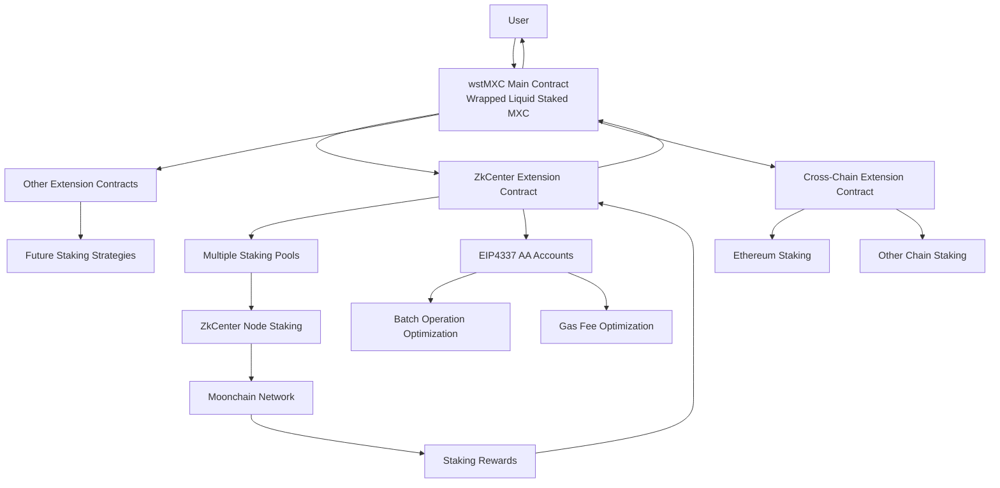
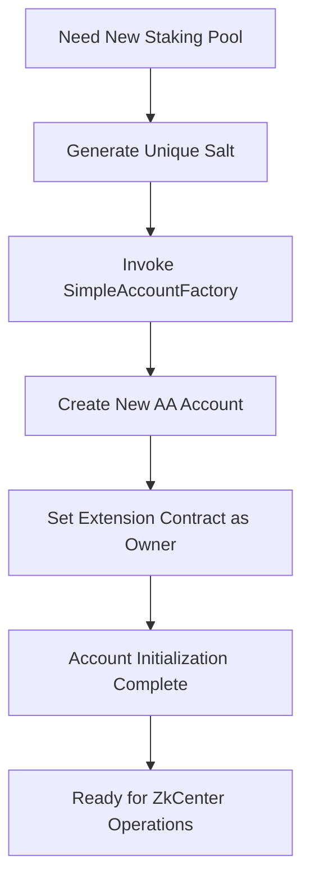
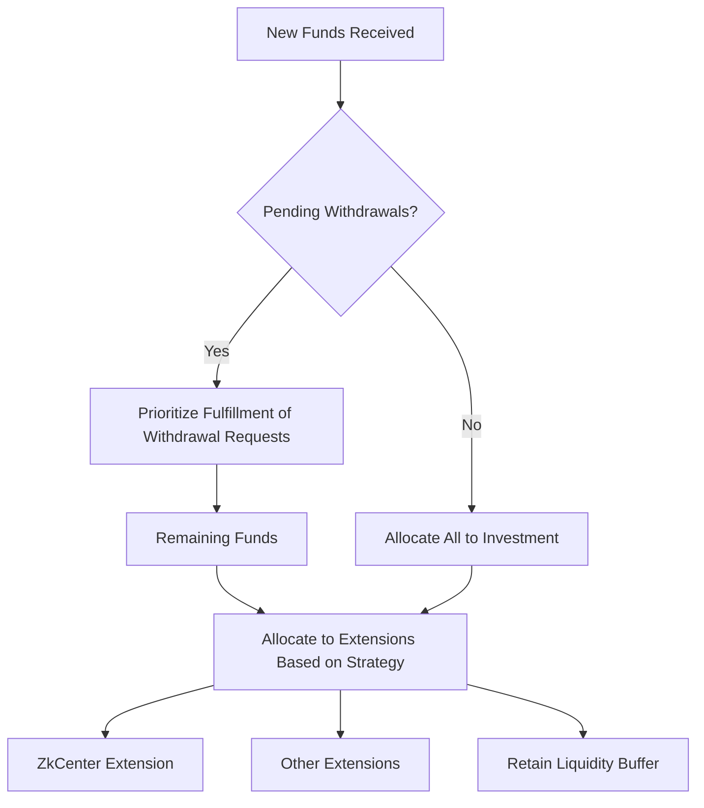
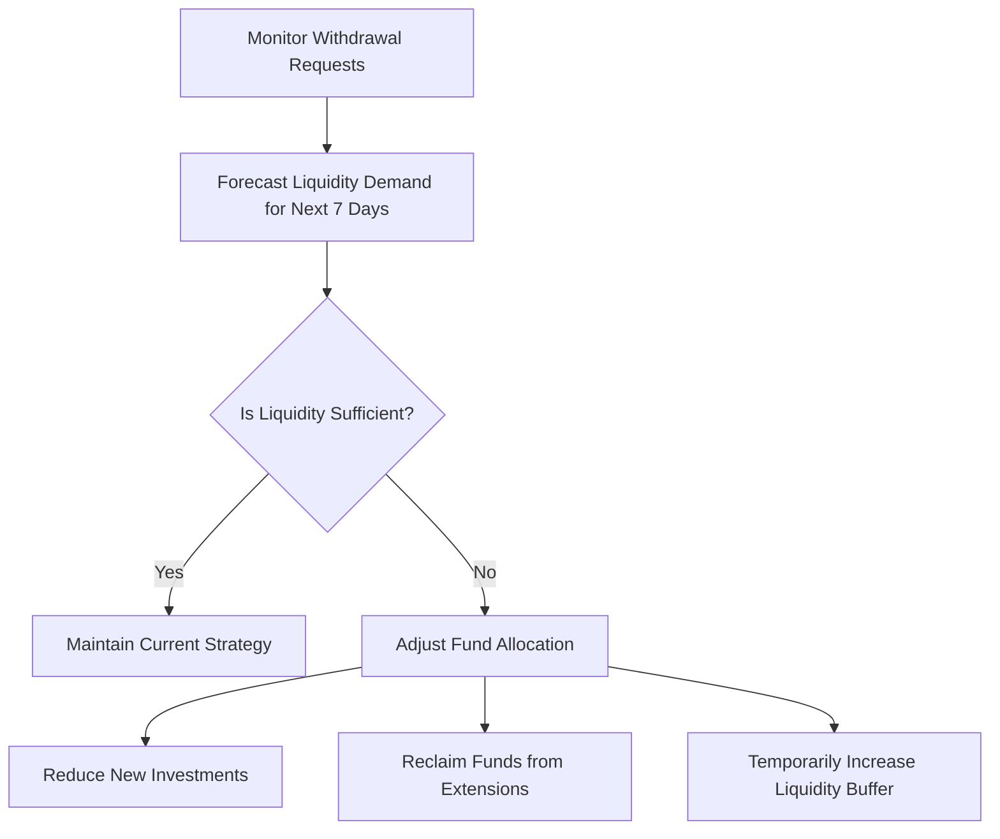
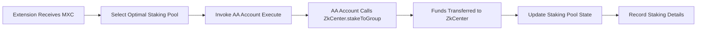
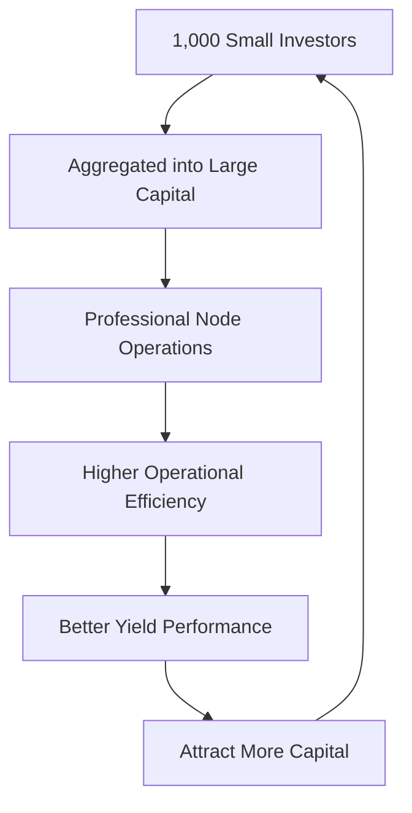

# wstMXC (Wrapped Liquid Staked MXC) Staking Tutorial

## Overview

wstMXC (Wrapped Liquid Staked MXC) is a liquid staking system based on the MXC token, inspired by Lido's stETH/wstETH mechanism, but specifically designed for the Moonchain ecosystem. Users can deposit MXC to receive tradeable wstMXC tokens while earning staking rewards. The system supports various staking strategies through innovative extension contract mechanisms, primarily integrating [ZkCenter ](https://doc.moonchain.com/docs/Moonchain-Design/zk)for node staking, with plans to expand to cross-chain staking.

## Core Business Architecture

### Key Component Relationships



## Deep Dive into the Extension Mechanism

### Core Design of the Extension Architecture

wstMXC adopts a modular extension mechanism, representing a core innovation compared to traditional single staking protocols:

#### 1. Unified Interface Standard (IWstMxcExtension)

**Core Method Definitions**

- `stake(address poolManager, uint256 amount)`: Accepts funds and executes staking.
- `requestUnstake(address poolManager, uint256 amount)`: Applies for unstaking.
- `completeUnstake(address poolManager)`: Completes unstaking and returns funds.
- `claimRewards(address poolManager)`: Claims rewards and transfers them back to the main contract.
- `totalMxcManaged()`: Reports the total amount of funds managed.
- `adminFeeBps()`: Reports the management fee rate.

**Advantages of Standardized Interfaces**

- The wstMXC main contract can uniformly manage all extensions.
- New extensions follow the standard, reducing integration costs.
- Supports hot-swapping, allowing extensions to be added or removed dynamically during runtime.

#### 2. Independent Lifecycle Management

**Fault Isolation Mechanism**

- Each extension operates independently, ensuring that a single fault does not affect the entire system.
- The main contract can halt problematic extensions in emergencies.
- Funds can be quickly withdrawn from malfunctioning extensions.

### Extension Types and Application Scenarios

#### 1. Staking Extensions

**ZkCenter Validator Extension**

- Specifically connects to Moonchain's [ZkCenter](https://doc.moonchain.com/docs/Moonchain-Design/zk) staking contract.
- Manages multiple staking pools for risk diversification.
- Optimizes operational efficiency through AA accounts.

#### 2. Cross-Moonchain Bridge Fund Management Extensions

**IHO Stake Mining Extension**

- Enables staking via cross-chain bridges to Moonchain and other networks.

## Deep Integration of EIP4337 Account Abstraction

### Core Role of AA Accounts in wstMXC

#### 1. Addressing Traditional EOA Limitations

**Traditional Challenges**

- Extension contracts require direct private key management to interact with external contracts.
- High security risks and complex private key management.
- Inability to perform batch operations and complex logic.

**AA Solutions**

- Extension contracts act as the owner of AA accounts.
- Account behavior is controlled via smart contract logic.
- Supports batch operations, gas optimization, and custom verification logic.

#### 2. AA Implementation in the ZkCenter Extension

**Account Creation Workflow**



**Operation Execution Mechanism**

- The extension contract calls `SimpleAccount.execute(target, value, data)`.
- The AA account verifies the caller's permissions.
- Executes the target contract call (e.g., ZkCenter.stakeToGroup).
- All operations are recorded on-chain for auditing.

#### 3. Business Advantages of AA Accounts

- Fund isolation.
- Batch processing of multiple staking pool operations in a single transaction.
- Significant reduction in gas costs.
- Enhanced operational efficiency.

### Example AA Account Operation Workflow

**Staking Workflow**

```mermaid
graph LR
    A[wstMXC Main Contract] --> B[ZkCenter Extension]
    B --> C[Select Staking Pool]
    C --> D[Retrieve Corresponding AA Account]
    D --> E[Construct ZkCenter Call Data]
    E --> F[Invoke AA Account Execute]
    F --> G[AA Account Verifies Permissions]
    G --> H[Execute ZkCenter.stakeToGroup]
    H --> I[Update Internal State]
    I --> J[Return Results to Main Contract]
```



## Detailed Business Processes

### 1. User Deposit Process

#### Deposit Workflow Details

1. **Preconditions**

   - The user must hold sufficient MXC tokens.
   - Authorization must be granted for the wstMXC contract to use the user's MXC.
   - The system checks if the contract status is normal.

2. **Exchange Rate Calculation and Token Minting**

   - The system calculates the real-time exchange rate based on the current `totalStaked` and `totalSupply`.
   - Calculates the amount of wstMXC tokens the user should receive based on the exchange rate.
   - Immediately mints wstMXC tokens for the user.

3. **Smart Fund Allocation Strategy**


#### Deposit Scenario Examples

**Scenario A: Early System Stage**

- User deposits 1,000 MXC.
- Receives 1,000 wstMXC (1:1 exchange rate).
- 800 MXC allocated to the [ZkCenter](https://doc.moonchain.com/docs/Moonchain-Design/zk) extension.
- 200 MXC retained as liquidity buffer.

**Scenario B: Mature System Stage**

- Current exchange rate: 1 wstMXC = 1.1 MXC (10% accrued rewards).
- User deposits 1,100 MXC.
- Receives 1,000 wstMXC.
- Funds are allocated to various extensions per current strategy.

### 2. Withdrawal Mechanism Deep Analysis

#### Two-Stage Withdrawal Design

**Stage 1: Withdrawal Request**

- The user's wstMXC is immediately burned.
- The corresponding amount of MXC is locked based on the current exchange rate.
- A withdrawal ticket with a unique ID is generated.
- Enters a cooldown period (default 7 days).

**Stage 2: Withdrawal Execution**

- After the cooldown period, the user can execute the withdrawal.
- The system checks if liquidity is sufficient.
- Transfers funds from the available pool to the user.
- The withdrawal ticket is destroyed.

#### Advanced Liquidity Management

**Multi-Layer Liquidity Sources**

1. **Main Contract Available Funds**: Priority usage.
2. **Rapid Unstake from Extensions**: Some extensions support quick unlocking.
3. **New User Deposits**: New funds are prioritized to fulfill withdrawals.

**Liquidity Forecasting and Management**



### 3. Dynamic Exchange Rate Update Mechanism

#### Factors Affecting Exchange Rate

**Positive Factors (Increase Exchange Rate)**

- [ZkCenter ](https://doc.moonchain.com/docs/Moonchain-Design/zk)staking rewards distribution.
- Returns from other extension contracts.
- Cross-chain staking rewards.

**Neutral Factors (No Impact on Exchange Rate)**

- User deposits and withdrawals.
- Redistribution of funds among extensions.
- Management fee collection (already deducted from rewards).

#### Timing of Exchange Rate Updates

1. **During Reward Distribution**: Extension contracts claim rewards and transfer them back to the main contract.
2. **During Deposit/Withdrawal**: Ensures users receive the latest fair price.
3. **Periodic Revaluation**: The system periodically assesses the value of assets managed by extensions.

### 4. ZkCenter Extension Detailed Business Logic

#### Staking Pool Management Strategy

**Dynamic Pool Creation and Management**

- Automatically creates staking pools based on fund inflows.
- Sets maximum staking limits per pool (configurable, e.g., 10,000 MXC).
- Load balancing algorithms ensure reasonable fund distribution among pools.

**AA Account Integration Advantages**

- Each staking pool corresponds to a SimpleAccount smart wallet.
- The extension contract acts as the owner of all accounts.
- Supports batch operations to reduce gas costs.
- Enhances security and operational flexibility.

#### Staking Operation Workflow

**Fund Staking Workflow**



**Reward Collection Workflow**

- Periodically scans all staking pools for claimable rewards.
- Batch calls each AA account's `stakeClaimReward` operation.
- Rewards collected are transferred back to the main contract after deducting management fees.
- The main contract updates `totalStaked` to reflect the increased exchange rate.

**Unstaking Process**

- Evaluates pool status upon receiving withdrawal requests.
- Prioritizes unstaking from pools with higher funds.
- Handles [ZkCenter](https://doc.moonchain.com/docs/Moonchain-Design/zk)'s unlocking time requirements.
- Unlocked funds are transferred back to the main contract to increase liquidity.

## Revenue Structure

- Base staking rewards from the Moonchain network.
- Node operation earnings from [ZkCenter](https://doc.moonchain.com/docs/Moonchain-Design/zk).
- IHO Stake Mining rewards.
- Ecosystem partnership revenues.

### Revenue Distribution and Compounding Mechanism

#### Fee Structure Details

**Extension Contract Management Fees**

- [ZkCenter](https://doc.moonchain.com/docs/Moonchain-Design/zk) Extension: 0.5%-1%.
- DeFi Extensions: 1%-2%.
- Cross-Chain Extensions: 1%-3% (considering additional costs).

**Protocol-Level Fees**

- wstMXC Protocol Fee: 0.5% (default).
- Adjustable through governance, capped at 2%.
- Used for protocol development and security maintenance.

**Net Yield Calculation**

```
User Net Annual Yield = Total Rewards - Extension Management Fees - Protocol Fees
```

#### Compounding Effect Analysis

**Automatic Reinvestment Mechanism**

- All rewards are automatically reinvested.
- No manual action required from users.
- Reflected in the rising exchange rate.

**Compounding Growth Example**

```
Year 1: 100 MXC → 108 MXC (8% yield)
Year 2: 108 MXC → 116.64 MXC (8% yield)
Year 3: 116.64 MXC → 125.97 MXC (8% yield)
```

## Value to the Moonchain Node Ecosystem

### Enhanced Network Security

#### Effect of Staking Volume Growth

**Lowering Barriers to Entry**

- Small investors can participate in node staking.
- No technical knowledge required to run nodes.
- Reduces minimum staking amount requirements.

**Increased Decentralization**

- Validator diversification through multiple staking pools.
- Avoids centralization risks from single large nodes.
- Promotes geographic distribution.

**Improved Economic Security**

- Increases the cost of attacking the network.
- Enhances economic incentives for honest behavior.
- Strengthens the network's overall resilience.

### Liquidity Ecosystem Development

#### DeFi Integration Benefits

**As a Base Asset**

- wstMXC can be used as collateral in other DeFi protocols.
- Supports lending, synthetic assets, and other applications.
- Expands MXC's use cases.

**Liquidity Mining Opportunities**

- wstMXC/MXC trading pairs offer arbitrage opportunities.
- Investment strategies combining with other assets.
- Enhances liquidity across the ecosystem.

#### Optimizing Capital Efficiency

**Aggregation Effect**



**Cost Sharing**

- Node operation costs are shared among all users.
- Services provided by professional technical teams.
- Reduces the complexity of running individual nodes.

### Promoting Ecosystem Development

#### Incentivizing Innovation

**Extension Development Incentives**

- Developers can create new extension contracts.
- Earn economic incentives through management fees.
- Encourages ecosystem innovation and competition.

**Cross-Chain Ecosystem Building**

- Connects Moonchain with other blockchains.
- Increases capital inflow and technical exchange.
- Elevates Moonchain's position in the industry.

#### Extension Contract Risks

**Access Requirements**

- Strict code audit requirements.
- Community voting to approve extension registration.
- Gradual fund allocation testing.

**Operation Monitoring**

- Real-time monitoring of extension contract status.
- Automatic alerts for anomalies.
- Rapid isolation of problematic extensions.

### Adjustable Parameters

#### Core Economic Parameters

**Fee Management**

- Protocol Management Fee: 0%-2% (currently 0.5%).
- Extension Management Fees: Customizable by extensions.
- Emergency fee adjustment authority.

**Time Parameters**

- Withdrawal Cooldown Period: 1-30 days (currently 7 days).
- Governance Voting Period: 3-14 days.
- Time Lock Delay: 24-72 hours.

**Risk Control Parameters**

- Maximum Fund Allocation per Extension: 10%-70%.
- Liquidity Buffer Ratio: 5%-30%.
- Maximum Withdrawal Limit per Transaction.

## Conclusion

wstMXC (Wrapped Liquid Staked MXC) provides a highly advanced, comprehensive, and secure liquid staking solution for the Moonchain ecosystem through its innovative extension contract mechanism, EIP4337 Account Abstraction integration, and planned cross-chain staking features.

### Core Value Proposition

**User Value**

- Dual benefits of liquidity and staking rewards.
- Diverse yield strategy options.
- Professional asset management services.

**Network Value**

- Enhances Moonchain network security.
- Improves decentralization.
- Promotes ecosystem development.

**Ecosystem Value**

- Drives DeFi innovation and growth.
- Builds cross-chain bridges.
- Creates a sustainable economic model.

### Technical Highlights

1. **Modular Extension Architecture**: Plugin integration supporting diverse staking strategies.
2. **AA Account Integration**: Smart wallet solution for operational efficiency and security.
3. **Cross-Chain Staking Plans**: Unified staking platform connecting multiple blockchain networks.

With continuous technological improvement and ecosystem development, wstMXC is poised to become a significant innovation in blockchain staking, delivering superior investment returns for users and contributing to the long-term prosperity of the Moonchain network.
