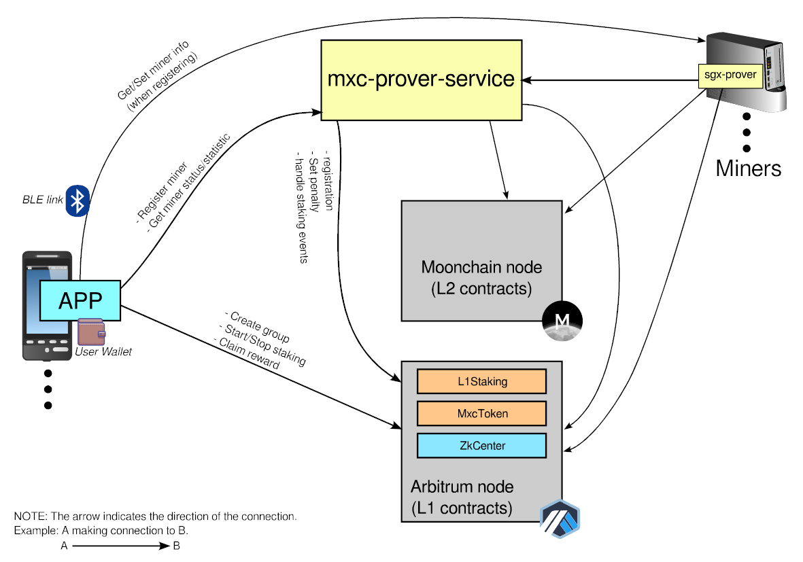
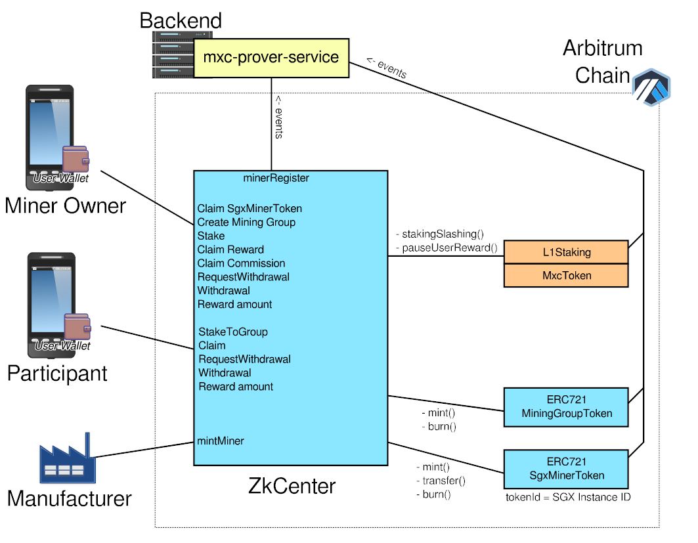

# Moonchain ZK Lite Paper

## Mint of MXC

At Moonchain, once a block is produced, validated, and verified, a certain amount of new MXC tokens will be minted. These newly minted MXC tokens are then added to the staking pool, where participants in the mining process can earn them as rewards.


## Participating

There are two types of participants: miner owners and those without miners who wish to join the process. Miner owners act as group leaders, forming mining groups and allowing others to participate. Group leaders must keep their miners in good condition to receive rewards. Those joining a group should choose one with a strong track record of miner performance, as any penalties imposed on a disqualified mining group will affect all associated participants.


*PS: The reward distribution shown above is subject to change over time.*


## System Block diagram



### APP

A mobile application for participants (end users).

### Proxy Service

A back-end service responsible for miner registration. It also analyses miner status and forwards the results to the staking contract.

### mxc-prover-service

A back-end service includes the prover manager and the Taiko-client-prover. It is responsible for SGX proof generation for miners, miner registration, and miner data analysis for penalty issuance.

### sgx-prover

A service running on the miner that retrieves jobs from the back end, generates SGX proofs, and submits them back.


## Contracts

The staking-related contracts have been deployed on the Arbitrum chain.



When an SGX miner is produced, the manufacturer mints an NFT for it. When a user purchases the miner, they can claim the corresponding NFT to their own wallet.

The miner owner, who also serves as the mining group leader, must first create a MiningGroupToken to establish a mining group. This allows other users to join and participate in the mining process. Once the group is formed, the miner owner can stake a designated amount of MXC into the pool and claim rewards after a set period.

Users without a miner can stake by referencing an existing group. When rewards are claimed, a portion of the earnings is allocated to the group leader as a commission.


## Staking Period (a Epoch)

A staking period, known as an epoch, lasts for seven days and aligns with every Thursday at 00:00 UTC. Rewards are calculated based on the number of epochs the amount has been staked.


## Penalty


#### Reward Reduction

If a miner's performance falls short of expectations, a penalty will be imposed on the associated participants—namely, the owner and those who have staked on the owner. As a result, the reward for one epoch will be reduced.

Penalty Condition (at the time of checking):

- The online time has not reached 85% in the past seven days.


#### Slash of staked amount

When a miner performing actions that harm the network, the staked amount linked to the miner will be slash. 

List of harmful actions:

- Submission of an Invalid Proof.
  A miner submitting an invalid proof, which will be rejected by the block proving process.
- Failure of Three Consecutive SGX Generation Jobs. **[To be apply later]**


## Interact with Contracts

The staking process interacts with the following contracts on the Arbitrum chain:

- **MXCL1** (TaikoL1.sol)

  Testnet: `0x6a5c9E342d5FB5f5EF8a799f0cAAB2678C939b0B`

  Mainnet: `0x54D8864e8855A7B66eE42B8F2Eaa0F2E06bd641a`

- **MxcToken** (MxcToken.sol)

- **L1Staking** (L1Staking.sol)

- **ZkCenter** (ZkCenter.sol)


The contract source code can be found in the [mxc-mono repository](https://github.com/MXCzkEVM/mxc-mono/tree/moonchain-mainnet/packages/protocol/contracts) and [mxc-zkcenter repository](https://github.com/MXCzkEVM/mxc-zkcenter).


Below are the example flows for basic staking actions.

#### Get contract addresses from MXCL1.


#### Create a group and stake (for miner owner)


#### Stake (non miner owner)


#### Claim


#### Withdraw


## Prover Service (back-end server) APIs for APP

Mainnet base URL: https://prover-manager.moonchain.com/

Testnet base URL: https://geneva-prover-manager.moonchain.com/


#### POST `/app/registerMiner1`

This is the first step of the miner registration. Call this with the created wallet address to start the process. A `agentToken` will return. The APP must send the wallet address and `agentToken` to the miner, then the miner will use this information to verify itself with the Prover Service.

Example POST data:

```
{
  "instanceId": 0,
  "walletAddress": "0x0123456789ABCDEF0123456789ABCDEF01234567"
}
```

Example response:

```
{
  "ret": 0,
  "message": "",
  "result": {
    "agentToken": "VZ/NkCa4I0WCzO9SW9HCx6fzgOYLpyXMC/uTqxG+qFA="
  }
}
```


#### POST `/app/registerMiner2`

This is the second step of the registration. After the miner verify itself with the `agentToken` got from step 1, this step will be success and returned a `appToken`. The `appToken` will be used to query the miner status later on.

Example POST data:

```
{
  "instanceId": 0
}
```

Example response (miner not verify yet):

```
{
  "ret": 0,
  "message": "Wait for miner.",
  "result": {
    "appToken": "",
	"waitForMiner": true
  }
}
```

Example response (miner verified):

```
{
  "ret": 0,
  "message": "",
  "result": {
    "appToken": "K6P1QE7Az6Qh8JmPFjgR1XhG9bbzWviO1zKMhWN2FyU",
	"waitForMiner": false  
  }
}
```


#### GET `/app/minerStatus/<INSTANCE_ID>`

Get the status of a miner.

Auth header:

```
"Authorization" : "Bearer <APP_TOKEN>"
```

Example response:

```
{
  "ret": 0,
  "message": "",
  "result": {
    "lastPing": "2025-02-10T15:01:34.000Z",
    "online": {"value": 1, "timestamp": "2025-02-10T15:00:00Z"},
    "proofReceived": {"value": 22, "timestamp": "2025-02-10T15:00:00Z"},
    "proofRejected": {"value": 15, "timestamp": "2025-02-10T15:00:00Z"}
  }
}
```

*"online", "proofReceived", "proofRejected" are statistic result of past 1 hour data.*


#### GET `/app/minerStatistic/<INSTANCE_ID>/<ITEM>/[daily]`

Retrieve a miner's statistical data. The `ITEM` parameter can be one of the following: `"online"`, `"proofReceived"`, or `"proofRejected"`. Additionally, the optional `daily` parameter returns data aggregated on a daily basis; if omitted, the data will be aggregated on a 7  days (1 epoch) basis.

Auth header:

```
"Authorization" : "Bearer <APP_TOKEN>"
```

Example response:

```
{
  "ret": 0,
  "message": "",
  "result": {
    "item": "proofReceived",
    "data": [
      {"value": 0, "timestamp": "2024-12-05T00:00:00Z"},
      {"value": 0, "timestamp": "2024-12-12T00:00:00Z"},
      {"value": 0, "timestamp": "2024-12-19T00:00:00Z"},
      {"value": 0, "timestamp": "2024-12-26T00:00:00Z"},
      {"value": 0, "timestamp": "2025-01-02T00:00:00Z"},
      {"value": 0, "timestamp": "2025-01-09T00:00:00Z"},
      {"value": 0, "timestamp": "2025-01-16T00:00:00Z"},
      {"value": 0, "timestamp": "2025-01-23T00:00:00Z"},
      {"value": 0, "timestamp": "2025-01-30T00:00:00Z"},
      {"value": 0, "timestamp": "2025-02-06T00:00:00Z"},
      {"value": 114,"timestamp": "2025-02-13T00:00:00Z"}
    ]
  }
}
```


## Miner Registration Flow

Here’s an example flow for registering a miner.

1. Purchase a miner.
2. Use the APP to create a wallet.
3. Connect to the miner via Bluetooth using the app.
4. The APP getting the instance ID via Bluetooth.
5. Perform first registration step with Prover Service with the wallet address and instance ID.
6. Save the wallet address and the received agent token to the miner. Then restart the service at miner.
7. Perform second registration step with Prover Service.
8. Claim the SGX miner NFT.


